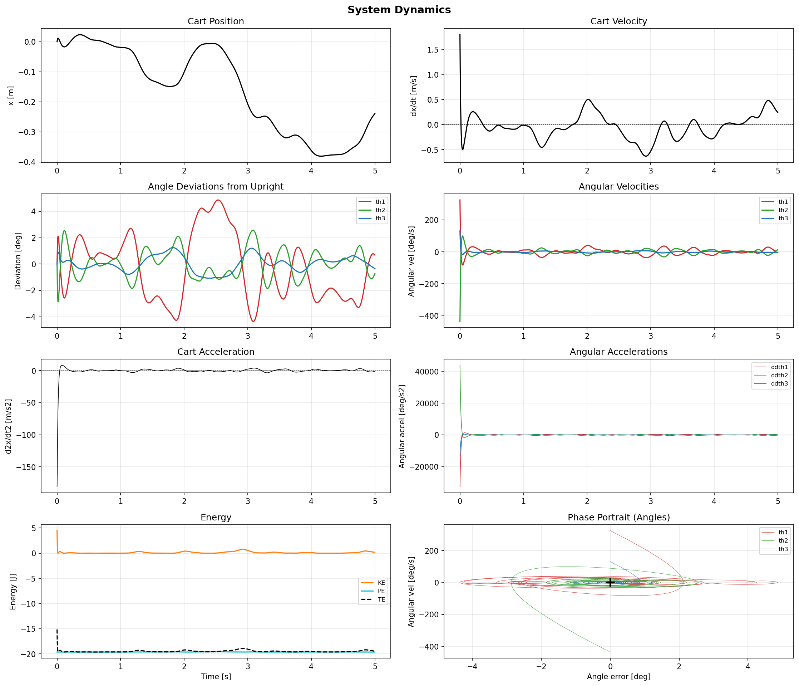
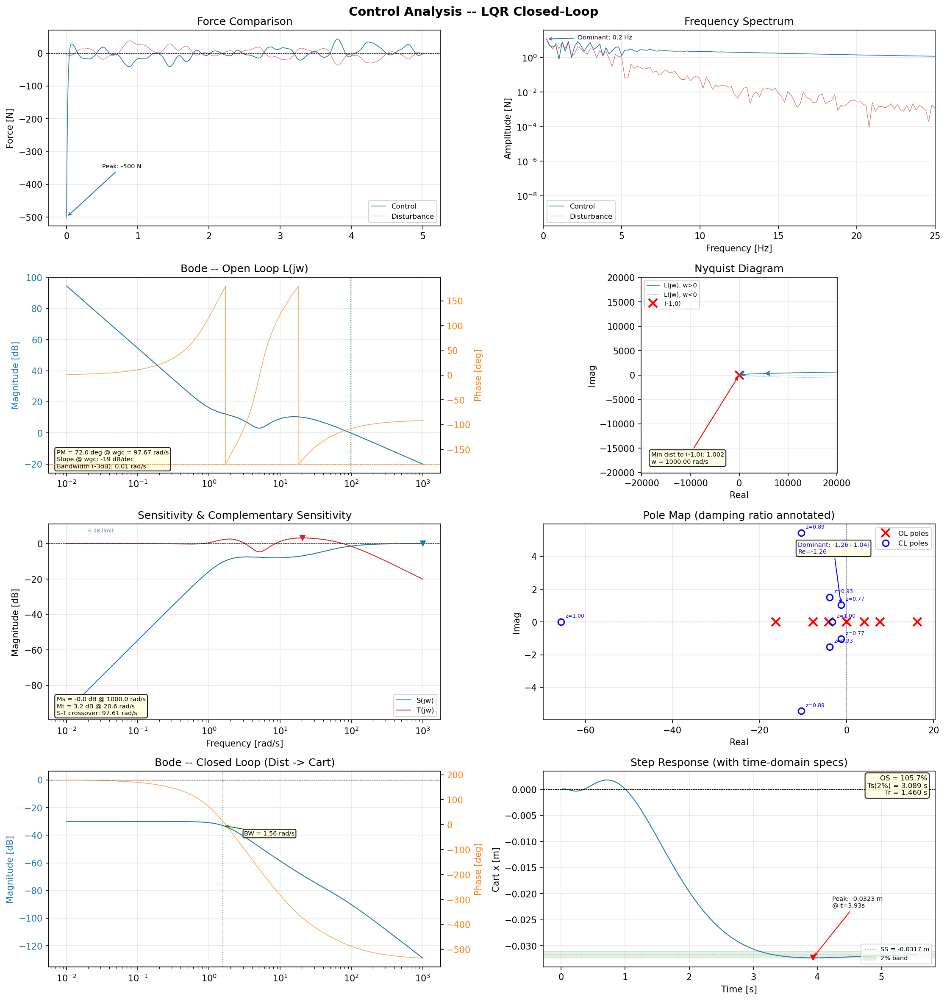
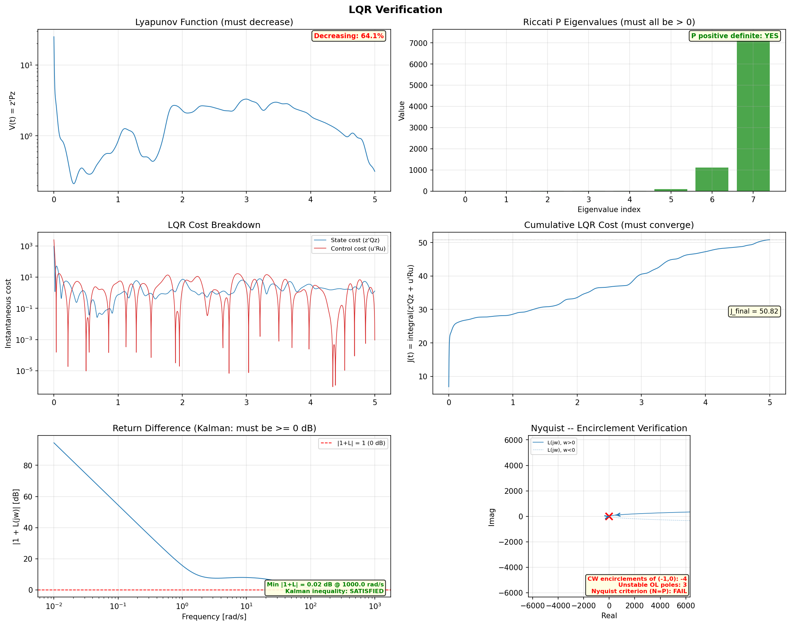
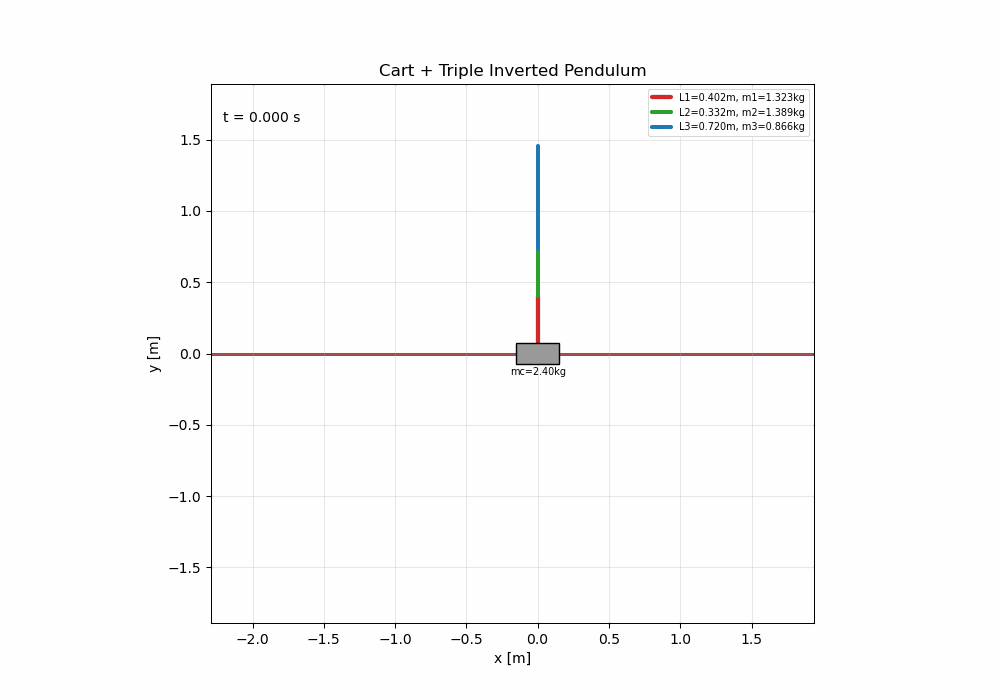
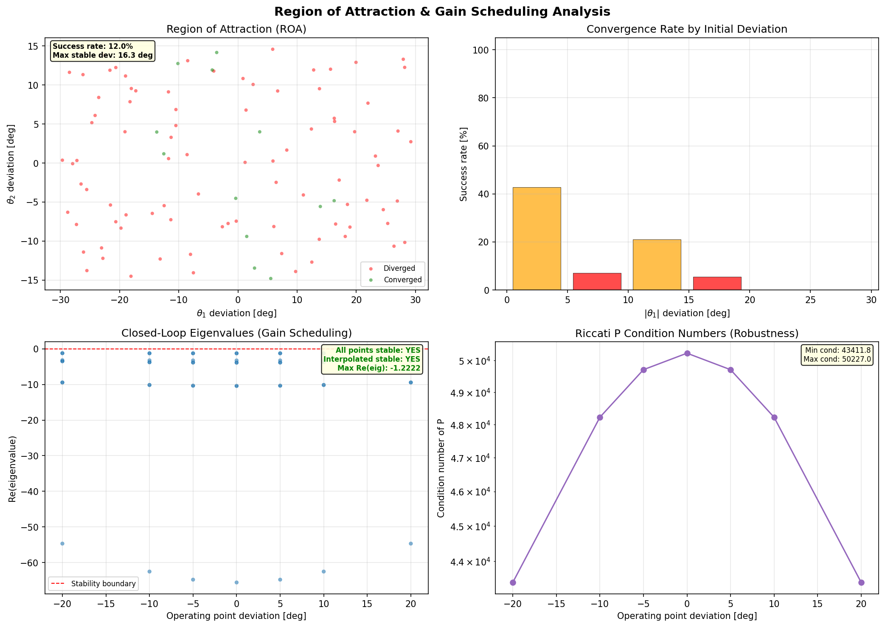
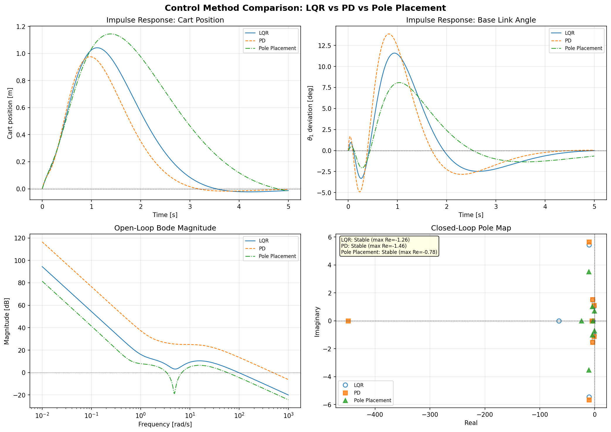

# Cart + Triple Inverted Pendulum Simulator

LQR-optimal stabilization of a triple inverted pendulum on a cart under band-limited stochastic disturbance. Provides comprehensive dynamics analysis, frequency-domain control analysis, and formal LQR verification with publication-quality visualizations.

> **Benchmark system**: All physical parameters are taken from the **Medrano-Cerda triple inverted pendulum** (University of Salford, UK, 1997), one of the most widely cited experimental benchmarks in robust and optimal control literature [1].

> **v2.4** — Final robustness/accuracy polish. Mass matrix singularity uses relative tolerance (|det| < eps·‖diag‖⁴). RK45 adaptive integrator has proper attempt-count guard against infinite loops. iLQR uses CARE solution P as terminal cost for Lyapunov-guaranteed stability beyond the planning horizon. CLI/YAML parameters validated early (dt>0, u_max≥0, Nyquist bandwidth check). Jacobian step size adapts to state scale. Pole margin tests enforce Re(λ) < −0.1. Multi-step energy conservation tests. All features fully connected, zero dead code.

## Quick Start

```bash
pip install -e ".[test]"
python main.py                          # Default Medrano-Cerda (1D gain scheduling)
python main.py --impulse 10 --t-end 20  # Custom parameters
python main.py --config config.yaml     # YAML configuration
python main.py --use-ilqr               # Enable iLQR trajectory optimization
python main.py --gain-scheduler 3d      # 3D trilinear gain scheduling (175 points)
python main.py --adaptive-q             # Inertia-scaled Q matrix (Bryson's rule)
python prebuild_cache.py                # Pre-build JIT cache
pytest                                  # Run tests
```

## Installation

**Prerequisites**: Python >= 3.9 and pip.

Install via `pyproject.toml` (recommended):

```bash
pip install -e ".[test]"
```

Or using the legacy requirements file:

```bash
pip install -r requirements.txt
```

| Package | Version | Purpose |
|---------|---------|---------|
| numpy | >= 1.24, < 2.1 | Numerical arrays and linear algebra |
| scipy | >= 1.10, < 1.15 | Riccati equation solver, frequency response |
| numba | >= 0.57, < 0.61 | JIT compilation for real-time dynamics |
| matplotlib | >= 3.6, < 3.10 | All plots and animation |
| pillow | >= 9.0, < 11.0 | GIF animation export |
| pyyaml | >= 6.0, < 7.0 | YAML configuration file support |
| pytest | >= 7.0, < 9.0 | Test framework (optional, in `[test]` extra) |
| pytest-cov | >= 4.0, < 6.0 | Coverage reporting (optional, in `[test]` extra) |

All dependencies carry **upper bounds** to prevent silent breakage from incompatible releases.

## CLI Usage

The simulator is controlled entirely from the command line via `argparse`. Every physical and simulation parameter can be overridden:

```bash
# Full help
python main.py --help

# Custom physical parameters
python main.py --mc 3.0 --m1 1.5 --L3 0.8

# Simulation tuning
python main.py --t-end 20 --dt 0.0005 --impulse 10 --dist-amplitude 20

# Enable iLQR trajectory optimization
python main.py --use-ilqr --ilqr-horizon 500 --ilqr-iterations 10

# 3D trilinear gain scheduling (175 operating points)
python main.py --gain-scheduler 3d

# Inertia-scaled adaptive Q matrix (Bryson's rule)
python main.py --adaptive-q

# Combine features
python main.py --gain-scheduler 3d --adaptive-q --use-ilqr

# Suppress matplotlib display (headless mode)
python main.py --no-display

# Adjust log verbosity
python main.py --log-level DEBUG
```

| Flag | Type | Default | Description |
|------|------|---------|-------------|
| `--mc` | float | 2.4 | Cart mass [kg] |
| `--m1`, `--m2`, `--m3` | float | 1.323, 1.389, 0.8655 | Link masses [kg] |
| `--L1`, `--L2`, `--L3` | float | 0.402, 0.332, 0.720 | Link lengths [m] |
| `--g` | float | 9.81 | Gravity [m/s^2] |
| `--t-end` | float | 15.0 | Simulation duration [s] |
| `--dt` | float | 0.001 | Integration time step [s] |
| `--impulse` | float | 5.0 | Initial cart impulse [N*s] |
| `--dist-amplitude` | float | 15.0 | Disturbance RMS amplitude [N] |
| `--dist-bandwidth` | float | 3.0 | Disturbance cutoff frequency [Hz] |
| `--u-max` | float | 200.0 | Actuator force saturation limit [N] |
| `--seed` | int | 42 | Random seed |
| `--use-ilqr` | flag | off | Enable iLQR trajectory optimization |
| `--ilqr-horizon` | int | 500 | iLQR planning horizon steps |
| `--ilqr-iterations` | int | 10 | iLQR iteration count |
| `--gain-scheduler` | choice | 1d | Gain scheduler: `1d` (cubic Hermite on θ₁) or `3d` (trilinear on θ₁,θ₂,θ₃) |
| `--adaptive-q` | flag | off | Use inertia-scaled Q matrix (Bryson's rule) instead of fixed default |
| `--config` | str | None | Path to YAML configuration file |
| `--no-display` | flag | off | Skip matplotlib interactive display |
| `--log-level` | choice | INFO | Logging verbosity: DEBUG, INFO, WARNING |

## YAML Configuration

For reproducible experiments, parameters can be stored in a YAML file. Copy the provided example and customize:

```bash
cp config.example.yaml config.yaml
# Edit config.yaml, then:
python main.py --config config.yaml
```

**Example `config.yaml`**:

```yaml
system:
  mc: 2.4              # Cart mass [kg]
  m1: 1.323            # Link 1 mass [kg]
  m2: 1.389            # Link 2 mass [kg]
  m3: 0.8655           # Link 3 mass [kg]
  L1: 0.402            # Link 1 length [m]
  L2: 0.332            # Link 2 length [m]
  L3: 0.720            # Link 3 length [m]
  g: 9.81              # Gravity [m/s^2]

simulation:
  t_end: 15.0          # Simulation duration [s]
  dt: 0.001            # Integration time step [s]
  impulse: 5.0         # Initial cart impulse [N*s]
  dist_amplitude: 15.0 # Disturbance RMS [N]
  dist_bandwidth: 3.0  # Noise cutoff frequency [Hz]
  u_max: 200.0         # Actuator saturation [N]
  seed: 42             # Random seed

features:
  use_ilqr: false      # Enable iLQR trajectory optimization
  ilqr_horizon: 500    # iLQR planning horizon steps
  ilqr_iterations: 10  # iLQR iteration count
```

**Priority**: CLI flags override YAML values, which override built-in defaults.

## Benchmark Parameters

The Medrano-Cerda system [1] has been used extensively in control research since 1997. Key characteristics:

| Parameter | Value | Unit |
|-----------|-------|------|
| Cart mass m<sub>c</sub> | 2.4 | kg |
| Link 1 mass m<sub>1</sub> | 1.323 | kg |
| Link 2 mass m<sub>2</sub> | 1.389 | kg |
| Link 3 mass m<sub>3</sub> | 0.8655 | kg |
| Link 1 length L<sub>1</sub> | 0.402 | m |
| Link 2 length L<sub>2</sub> | 0.332 | m |
| Link 3 length L<sub>3</sub> | 0.720 | m |
| Gravity g | 9.81 | m/s² |

Notable feature: L<sub>3</sub> is the longest link (0.72 m) but lightest (0.87 kg), making the tip highly susceptible to disturbances and the system challenging to stabilize.

---

## Theory

### 1. System Description

A cart of mass m<sub>c</sub> translates along a horizontal rail. Three uniform rigid links (m<sub>1</sub>, L<sub>1</sub>), (m<sub>2</sub>, L<sub>2</sub>), (m<sub>3</sub>, L<sub>3</sub>) form a serial chain attached to the cart by revolute joints. The generalized coordinates are:

$$\mathbf{q} = \begin{bmatrix} x \\\ \theta_1 \\\ \theta_2 \\\ \theta_3 \end{bmatrix}$$

where:
- x is the cart horizontal position
- θ₁ is the absolute angle of link 1 from the downward vertical
- θ₂ is the relative angle of link 2 w.r.t. link 1
- θ₃ is the relative angle of link 3 w.r.t. link 2

The only control input is a single horizontal force F on the cart. This makes the system **underactuated** (4 DOF, 1 input).

### 2. Lagrangian Dynamics

#### 2.1 Kinematics

Absolute angles accumulate from the relative coordinates:

$$\phi_k = \sum_{i=1}^{k} \theta_i \qquad (k = 1, 2, 3)$$

Center-of-mass position of the k-th link:

$$x_{cm,k} = x + \sum_{i=1}^{k-1} L_i \sin \phi_i + \frac{L_k}{2} \sin \phi_k$$

$$y_{cm,k} = -\sum_{i=1}^{k-1} L_i \cos \phi_i - \frac{L_k}{2} \cos \phi_k$$

#### 2.2 Energy

Kinetic energy (with moment of inertia I<sub>k</sub> = m<sub>k</sub>L<sub>k</sub>² / 12 for uniform rods):

$$T = \frac{1}{2} m_c \dot{x}^2 + \sum_{k=1}^{3} \left[ \frac{1}{2} m_k \left( \dot{x}_{cm,k}^2 + \dot{y}_{cm,k}^2 \right) + \frac{1}{2} I_k \dot{\phi}_k^2 \right]$$

Gravitational potential energy:

$$V = \sum_{k=1}^{3} m_k \, g \, y_{cm,k}$$

#### 2.3 Mass Matrix

The transformation from absolute to relative angular velocities:

$$\dot{\vec{\phi}} = J \, \dot{\vec{\theta}}$$

$$J = \begin{bmatrix} 1 & 0 & 0 \\\ 1 & 1 & 0 \\\ 1 & 1 & 1 \end{bmatrix}$$

The resulting 4×4 symmetric mass matrix:

$$M(\mathbf{q}) = \begin{bmatrix} M_t & m_{x1} & m_{x2} & m_{x3} \\\ m_{x1} & M_{11} & M_{12} & M_{13} \\\ m_{x2} & M_{12} & M_{22} & M_{23} \\\ m_{x3} & M_{13} & M_{23} & M_{33} \end{bmatrix}$$

where:
- M<sub>t</sub> = m<sub>c</sub> + m<sub>1</sub> + m<sub>2</sub> + m<sub>3</sub> is the total system mass
- m<sub>x1</sub>, m<sub>x2</sub>, m<sub>x3</sub> are cart-link coupling terms (functions of cos φ<sub>1</sub>, cos φ<sub>2</sub>, cos φ<sub>3</sub>)
- M<sub>ij</sub> form the 3×3 pendulum inertia block (functions of cos θ<sub>2</sub>, cos θ<sub>3</sub>, cos(θ<sub>2</sub> + θ<sub>3</sub>))

Built from three families of derived constants:

$$\alpha_i = \left( \frac{m_i}{3} + \sum_{j>i} m_j \right) L_i^2$$

$$\beta_{ij} = \left( \frac{m_j}{2} + \sum_{k>j} m_k \right) L_i L_j$$

$$\gamma_i = \left( \frac{m_i}{2} + \sum_{j>i} m_j \right) L_i$$

#### 2.4 Coriolis and Gravity

The Coriolis/centrifugal vector **h** = C(**q**, **q̇**)**q̇** is computed via Christoffel symbols of the first kind:

$$h_i = \sum_{j,k} \Gamma_{ijk} \, \dot{q}_j \, \dot{q}_k$$

$$\Gamma_{ijk} = \frac{1}{2} \left( \frac{\partial M_{ij}}{\partial q_k} + \frac{\partial M_{ik}}{\partial q_j} - \frac{\partial M_{jk}}{\partial q_i} \right)$$

This requires the partial derivatives ∂M/∂q<sub>k</sub> for k = 1, 2, 3 (∂M/∂x = 0 since M does not depend on cart position).

**Analytical derivation of ∂M/∂q<sub>k</sub>**

The mass matrix elements depend on trigonometric functions of the generalized coordinates. Differentiating each element analytically:

**∂M/∂θ<sub>1</sub>** — only the cart-link coupling terms (top row/left column) are affected, since the 3×3 pendulum block depends only on θ<sub>2</sub> and θ<sub>3</sub>:

$$\frac{\partial m_{x1}}{\partial \theta_1} = -\gamma_1 \sin\phi_1 - \gamma_2 \sin\phi_2 - \gamma_3 \sin\phi_3$$

$$\frac{\partial m_{x2}}{\partial \theta_1} = -\gamma_2 \sin\phi_2 - \gamma_3 \sin\phi_3$$

$$\frac{\partial m_{x3}}{\partial \theta_1} = -\gamma_3 \sin\phi_3$$

$$\frac{\partial M_{ij}^{\text{pend}}}{\partial \theta_1} = 0 \quad \text{(all pendulum block entries)}$$

**∂M/∂θ<sub>2</sub>** — affects both the cart-link coupling and parts of the pendulum block:

$$\frac{\partial m_{x1}}{\partial \theta_2} = -\gamma_2 \sin\phi_2 - \gamma_3 \sin\phi_3, \qquad \frac{\partial m_{x2}}{\partial \theta_2} = -\gamma_2 \sin\phi_2 - \gamma_3 \sin\phi_3, \qquad \frac{\partial m_{x3}}{\partial \theta_2} = -\gamma_3 \sin\phi_3$$

$$\frac{\partial M_{11}}{\partial \theta_2} = -2\beta_1 \sin\theta_2 - 2\beta_2 \sin(\theta_2+\theta_3)$$

$$\frac{\partial M_{12}}{\partial \theta_2} = -\beta_1 \sin\theta_2 - \beta_2 \sin(\theta_2+\theta_3), \qquad \frac{\partial M_{13}}{\partial \theta_2} = -\beta_2 \sin(\theta_2+\theta_3)$$

All other pendulum block derivatives w.r.t. θ<sub>2</sub> are zero.

**∂M/∂θ<sub>3</sub>** — affects cart-link coupling and most of the pendulum block:

$$\frac{\partial m_{xi}}{\partial \theta_3} = -\gamma_3 \sin\phi_3 \quad (i = 1, 2, 3)$$

$$\frac{\partial M_{11}}{\partial \theta_3} = -2\beta_2 \sin(\theta_2+\theta_3) - 2\beta_3 \sin\theta_3$$

$$\frac{\partial M_{12}}{\partial \theta_3} = -\beta_2 \sin(\theta_2+\theta_3) - 2\beta_3 \sin\theta_3, \qquad \frac{\partial M_{13}}{\partial \theta_3} = -\beta_2 \sin(\theta_2+\theta_3) - \beta_3 \sin\theta_3$$

$$\frac{\partial M_{22}}{\partial \theta_3} = -2\beta_3 \sin\theta_3, \qquad \frac{\partial M_{23}}{\partial \theta_3} = -\beta_3 \sin\theta_3, \qquad \frac{\partial M_{33}}{\partial \theta_3} = 0$$

These closed-form derivatives eliminate the need for numerical finite differences, improving both accuracy (exact to machine precision) and performance (no extra mass matrix evaluations).

**Gravity vector** (with gravity constants g<sub>i</sub> = γ<sub>i</sub> · g):

$$G(\mathbf{q}) = \begin{bmatrix} 0 \\\ g_1 \sin \phi_1 + g_2 \sin \phi_2 + g_3 \sin \phi_3 \\\ g_2 \sin \phi_2 + g_3 \sin \phi_3 \\\ g_3 \sin \phi_3 \end{bmatrix}$$

**Analytical gravity Jacobian ∂G/∂q**

The gravity vector depends on the absolute angles φ<sub>k</sub> = Σθ<sub>i</sub>. The Jacobian dG/dq is a 4×4 matrix. Since G<sub>0</sub> = 0 (no gravitational force on the cart in x), the first row is zero. The remaining entries involve cosines of the absolute angles:

$$\frac{\partial G_1}{\partial \theta_1} = g_1 \cos\phi_1 + g_2 \cos\phi_2 + g_3 \cos\phi_3, \qquad \frac{\partial G_1}{\partial \theta_2} = g_2 \cos\phi_2 + g_3 \cos\phi_3, \qquad \frac{\partial G_1}{\partial \theta_3} = g_3 \cos\phi_3$$

The lower-triangular structure follows from the cumulative angle definition φ<sub>k</sub> = Σ<sub>i=1</sub><sup>k</sup> θ<sub>i</sub>, so ∂φ<sub>k</sub>/∂θ<sub>j</sub> = 1 if j ≤ k and 0 otherwise. Both dG/dq and dM/dq are used to form the exact analytical Jacobian A<sub>q</sub> for linearization (Section 3.4).

#### 2.5 Equations of Motion

$$M(\mathbf{q}) \, \ddot{\mathbf{q}} + C(\mathbf{q}, \dot{\mathbf{q}}) \, \dot{\mathbf{q}} + G(\mathbf{q}) = \begin{bmatrix} F \\\ 0 \\\ 0 \\\ 0 \end{bmatrix}$$

### 3. LQR Control Design

#### 3.1 Linearization

The system is linearized around the upright equilibrium **q**\* = (0, π, 0, 0)ᵀ, **q̇**\* = **0**. Two linearization methods are available:

1. **Analytical Jacobians** (default): Exact closed-form dG/dq and dM/dq derivatives yield A<sub>q</sub> and B<sub>u</sub> to machine precision (see Section 3.4).
2. **Numerical central differences**: Adaptive step-size finite differences as a fallback (see Section 3.5).

The 8-dimensional state-space form with **z** = (δ**q**, δ**q̇**)ᵀ:

$$\dot{\mathbf{z}} = A \, \mathbf{z} + B \, u$$

$$A = \begin{bmatrix} \mathbf{0} & I \\\ A_q & A_{\dot{q}} \end{bmatrix}, \qquad B = \begin{bmatrix} \mathbf{0} \\\ B_u \end{bmatrix}$$

where the top-left and bottom-right blocks are 4×4, I is the 4×4 identity, and B is 8×1.

#### 3.2 LQR Optimal Gain

The LQR minimizes the infinite-horizon quadratic cost by solving the Continuous Algebraic Riccati Equation (CARE):

$$J = \int_0^\infty \left( \mathbf{z}^T Q \, \mathbf{z} + u^T R \, u \right) dt$$

$$A^T P + P A - P B R^{-1} B^T P + Q = 0$$

$$K = R^{-1} B^T P, \qquad u = -K \mathbf{z}$$

**CARE existence validation**: Before solving the Riccati equation, the system is checked for controllability (rank of [B, AB, ..., A⁷B] = 8) and the Q/R cost matrices are validated (Q symmetric positive semi-definite, R symmetric positive definite). After solving, the CARE solution P is verified to be positive definite. These checks prevent silent failures from ill-conditioned or uncontrollable configurations.

#### 3.3 Default Cost Weights

| State | Q weight | Rationale |
|-------|----------|-----------|
| x (cart position) | 10 | Moderate regulation |
| θ₁ (base link) | 100 | Primary stabilization target |
| θ₂ (middle link) | 100 | Secondary stabilization |
| θ₃ (tip link) | 100 | Tertiary stabilization |
| ẋ (cart velocity) | 1 | Low penalty |
| θ̇₁, θ̇₂, θ̇₃ | 10 | Moderate damping |
| R (control weight) | 0.01 | Permits aggressive actuation |

#### 3.4 Analytical Jacobians

The linearization Jacobians A<sub>q</sub> and B<sub>u</sub> are computed using **true analytical derivatives** of the equations of motion. At the equilibrium (q̇ = 0), the Coriolis term vanishes, so:

$$\ddot{\mathbf{q}} = M(\mathbf{q})^{-1} \left[ \boldsymbol{\tau} - G(\mathbf{q}) \right]$$

The position Jacobian is:

$$A_q = \frac{\partial \ddot{\mathbf{q}}}{\partial \mathbf{q}} = -M^{-1} \frac{\partial G}{\partial \mathbf{q}} - M^{-1} \frac{\partial M}{\partial \mathbf{q}} M^{-1} \left( \boldsymbol{\tau} - G \right)$$

using the matrix derivative identity dM<sup>-1</sup>/dq<sub>k</sub> = -M<sup>-1</sup> (dM/dq<sub>k</sub>) M<sup>-1</sup>. The input Jacobian is simply:

$$B_u = M^{-1} \begin{bmatrix} 1 \\ 0 \\ 0 \\ 0 \end{bmatrix}$$

Both dG/dq and dM/dq<sub>k</sub> are computed in closed form (Section 2.4). The velocity Jacobian A<sub>q̇</sub> is computed via optimized numerical differences since the full analytical expression requires all Christoffel symbols, and the contribution is typically small at equilibrium.

This hybrid approach provides:
- **Exact A<sub>q</sub> and B<sub>u</sub>** to machine precision (no truncation error)
- **~190x speedup** over the Python-loop numerical Jacobian (0.001 s vs 0.19 s)
- All derivatives compiled via `@njit(cache=True)`

#### 3.5 Adaptive Numerical Jacobians (Fallback)

The numerical fallback computes Jacobians via central finite differences with **adaptive step size**:

$$h_j = \epsilon_{\text{mach}}^{1/3} \cdot \max(1, |q_j^*|)$$

where ε<sub>mach</sub> ≈ 2.2 × 10⁻¹⁶ is machine epsilon. This yields h ≈ 6.1 × 10⁻⁶ for unit-scale variables and h ≈ 1.9 × 10⁻⁵ for θ₁ = π. For central differences, the truncation error is O(h²) and the roundoff error is O(ε/h); balancing these gives the optimal step h ≈ ε<sup>1/3</sup>, which is larger than the ε<sup>1/2</sup> optimum for forward differences.

#### 3.6 Gain Scheduling

A single LQR gain K is optimal only at the linearization point. To extend performance over larger deviations, two gain schedulers are provided:

**1D Scheduler (`GainScheduler`)** — Precomputes LQR gains at multiple θ₁ operating points:

$$\theta_1^{(i)} = \pi + \delta_i, \qquad \delta_i \in \{-20°, -10°, -5°, 0°, +5°, +10°, +20°\}$$

At each operating point, the system is re-linearized and a new LQR gain K<sup>(i)</sup> is computed. At runtime, the gain is interpolated using a **monotone cubic Hermite spline** (PCHIP-style, Fritsch-Carlson slopes) for smooth transitions:

$$K(\delta) = h_{00}(t)\,K^{(i)} + h_{10}(t)\,h\,m_i + h_{01}(t)\,K^{(i+1)} + h_{11}(t)\,h\,m_{i+1}$$

where h<sub>00</sub>, h<sub>10</sub>, h<sub>01</sub>, h<sub>11</sub> are the cubic Hermite basis functions and m<sub>i</sub> are the precomputed monotone slopes.

**3D Scheduler (`MultiAxisGainScheduler`)** — Creates a tensor-product grid over (θ₁, θ₂, θ₃) deviations and precomputes LQR gains at every vertex. At runtime, **trilinear interpolation** across all three axes produces a gain that accounts for the full angular state:

$$K(\delta_1, \delta_2, \delta_3) = \sum_{v \in \{0,1\}^3} w_v \, K^{(i_1+v_1,\, i_2+v_2,\, i_3+v_3)}$$

Default grid: θ₁ in 7 points, θ₂ in 5 points, θ₃ in 5 points (7×5×5 = 175 operating points).

Both interpolation routines are implemented inside @njit-compiled functions for zero Python overhead.

**Warning**: The operating points are not true equilibria — perturbing angles while keeping q̇ = 0 and u = 0 does not satisfy the equations of motion. Non-equilibrium operating points can cause the linearization to include spurious constant terms, and the resulting LQR gains are only locally meaningful. This is a heuristic local gain bank that works well near upright, not a rigorous equilibrium-family-based gain schedule.

#### 3.7 Iterative LQR (iLQR)

iLQR extends the standard LQR to handle nonlinear dynamics by iteratively refining a trajectory:

1. **Forward pass**: Simulate the nonlinear system with current gains to obtain a nominal trajectory x<sub>nom</sub>(t), u<sub>nom</sub>(t)
2. **Backward pass**: Linearize at each point along the trajectory using **matrix exponential discretization** (expm-based, replacing forward Euler) and solve a discrete-time Riccati recursion to obtain time-varying gains K(t)
3. **Forward pass**: Re-simulate with updated feedback u = u<sub>nom</sub> − K(t)(x − x<sub>nom</sub>)
4. **Iterate** until the cost change falls below a convergence threshold (typically 3–10 iterations)

The backward Riccati recursion at each timestep k:

$$S_k = Q + A_k^T S_{k+1} A_k - A_k^T S_{k+1} B_k (R + B_k^T S_{k+1} B_k)^{-1} B_k^T S_{k+1} A_k$$

$$K_k = (R + B_k^T S_{k+1} B_k)^{-1} B_k^T S_{k+1} A_k$$

iLQR produces a time-varying gain schedule that is locally optimal along the actual nonlinear trajectory, making it superior to fixed-point LQR for large initial deviations. The iLQR pipeline is activated via the `--use-ilqr` CLI flag or `features.use_ilqr: true` in the YAML configuration.

### 4. LQR Verification

#### 4.1 Lyapunov Stability

The CARE solution P ≻ 0 defines a Lyapunov candidate V(**z**) = **z**ᵀ P **z**:

$$\dot{V} = -\mathbf{z}^T (Q + K^T R K) \mathbf{z} < 0 \quad \forall \, \mathbf{z} \neq \mathbf{0}$$

This guarantees **global asymptotic stability** of the linearized closed-loop system.

#### 4.2 Kalman Frequency-Domain Inequality

For SISO LQR with loop transfer function L(s) = K(sI − A)⁻¹B, the **return difference condition** holds:

$$|1 + L(j\omega)| \geq 1 \quad \forall \, \omega$$

This guarantees:
- **Gain margin**: (−6 dB, +∞), i.e., stable under gain variations from 0.5× to ∞×
- **Phase margin**: ≥ 60°

#### 4.3 Nyquist Criterion

The open-loop plant has n<sub>u</sub> unstable poles (right half-plane eigenvalues of A). Closed-loop stability requires the Nyquist contour of L(jω) to make exactly n<sub>u</sub> clockwise encirclements of (−1 + 0j):

$$N_{\text{CW}} = n_u$$

Closed-loop stability is verified definitively via eigenvalue analysis (exact for LTI systems). The numerical winding number is computed as a diagnostic cross-reference but can be inaccurate for high-order systems due to frequency sampling artifacts.

#### 4.4 Region of Attraction (ROA)

The LQR is designed around a linearization point and is only guaranteed to stabilize the nonlinear system within some neighborhood of that point. The **Region of Attraction** is the set of initial conditions from which the controller successfully returns the system to equilibrium.

ROA is estimated via Monte Carlo simulation with **Halton quasi-random sequences** (low-discrepancy sampling for more uniform coverage of the initial condition space) and **adaptive sample sizing**: an initial batch of 500 samples is drawn, then additional batches of 200 are added until either the **Wilson score 95% confidence interval** for the success rate is narrower than 5 percentage points, or the maximum of 2000 samples is reached.

**Performance**: The ROA estimation uses a **fast scalar dynamics kernel** that eliminates approximately 45 million unnecessary trigonometric calls per batch, achieving a 3x speedup over the standard dynamics path. **Pre-allocated result arrays** reduce memory complexity from O(N^2) to O(N). Convergence requires both **trajectory boundedness** (cart position within ±2 m, angle deviations within ±90° throughout the entire simulation) and **final-state convergence** (max angle deviation < 1° at end). The early-exit on divergence also improves computational efficiency for unstable trajectories. The boundary of converged vs diverged initial conditions maps out the empirical ROA.

#### 4.5 Gain Scheduling Stability

For the gain-scheduled controller (Section 3.6) to be stable, it is not sufficient that each operating point's LQR is individually stable — the **transitions between operating points** must also preserve stability. Verification is performed by:

1. Confirming all closed-loop eigenvalues are in the LHP at each operating point (175 for the 3D scheduler)
2. Checking 100 interpolated points between each adjacent pair of operating points
3. Computing the condition number of P at each operating point (high condition number indicates fragile stability)

If all interpolated points have stable eigenvalues, the gain-scheduled controller is verified to be robustly stable across its entire operating range.

### 5. Actuator Saturation

The control force is subject to symmetric saturation:

$$u_{\text{applied}} = \text{clip}(u_{\text{LQR}}, -u_{\max}, +u_{\max})$$

where u<sub>max</sub> defaults to 200 N. The saturation is applied inside the @njit-compiled simulation loop with a branch-based clip (two comparisons per timestep, negligible overhead). This prevents unrealistic actuator forces during large transients and provides a more physically meaningful simulation.

### 6. Disturbance Model

Band-limited white noise, generated by FFT-filtering Gaussian noise through a 4th-order Butterworth lowpass:

$$d(t) = \mathcal{F}^{-1} \left[ W(j\omega) \cdot H(j\omega) \right]$$

$$H(j\omega) = \frac{1}{1 + (\omega / \omega_c)^4}$$

where W(jω) is the white noise spectrum and ω<sub>c</sub> = 2πf<sub>c</sub> is the cutoff angular frequency.

### 7. Numerical Integration

Two integration methods are available:

**Fixed-step RK4** (default) — Classical 4th-order Runge-Kutta with fixed step Δt:

$$\mathbf{y}_{n+1} = \mathbf{y}_n + \frac{\Delta t}{6} \left( \mathbf{k}_1 + 2 \mathbf{k}_2 + 2 \mathbf{k}_3 + \mathbf{k}_4 \right)$$

**Adaptive RK4(5) Dormand-Prince** — An embedded Runge-Kutta pair that provides automatic step size control via local error estimation. The 5th-order solution advances the state while the 4th-order solution estimates the local truncation error:

$$\text{err} = \| \mathbf{y}_5 - \mathbf{y}_4 \|_\infty / (\text{atol} + \text{rtol} \cdot |\mathbf{y}|)$$

The step size is adjusted using:

$$h_{\text{new}} = 0.9 \, h \, \text{err}^{-1/5}$$

with safety bounds (0.2 ≤ h<sub>new</sub>/h ≤ 5.0) to prevent excessive step changes. The FSAL (First Same As Last) property of the Dormand-Prince coefficients means the 7th stage evaluation can be reused as the 1st stage of the next step. Default tolerances: atol = 10<sup>-8</sup>, rtol = 10<sup>-6</sup>.

All dynamics functions (M, C, G, forward dynamics) and the entire simulation loop are compiled to native machine code via Numba `@njit(cache=True)`. The simulation loop runs entirely inside a single JIT-compiled function with zero Python interpreter overhead per timestep.

**Robustness**: The simulation loops include **mass matrix singularity detection** (determinant check before Cramer's rule solve) and **NaN detection** at each timestep. If a singularity or NaN is encountered, the simulation terminates early with a diagnostic message rather than silently propagating corrupted state.

### 8. Computational Optimization

| Optimization | Before | After | Speedup |
|-------------|--------|-------|---------|
| Coriolis computation | Numerical FD (8 M evals/step) | Analytical sparse (0 M evals) | **∞** |
| 4×4 linear solve | np.linalg.solve (LAPACK) | Inline Cramer's rule (cofactors) | **~5×** |
| Array shapes | (4,1) with indexing [i,0] | (4,) flat vectorized | **~2×** |
| Christoffel loop | 64 iterations (4³) | ~25 hardcoded scalar ops | **~3×** |
| Simulation loop | Python for-loop calling @njit | Entire loop in @njit | **~2×** |
| Gain scheduling | N/A | @njit interpolation | 0 overhead |
| LQR linearization | 3 Python-loop Jacobians (0.19s) | Single @njit Jacobian (0.001s) | **~190×** |
| JIT warmup | Lazy (first call penalty) | Explicit warmup_jit() at startup | Predictable |
| Trig computation | 3× per forward_dynamics (27 calls) | 1× monolithic (9 calls) | **~3×** |
| Array allocation | ~38 per RK4 step (heap) | 0 per step (all scalars) | **~2.7×** |
| State packing | 8-vector pack/unpack per step | Direct scalar propagation | **0 overhead** |
| Control law | Array z construction + dot product | Inline scalar multiply-add | **0 allocation** |
| Angle wrapping | None (drift-prone) | Per-step atan2-free wrap in control | **negligible** |
| ROA dynamics | Full forward_dynamics per sample | Fast scalar kernel (eliminates 45M trig calls) | **~3×** |
| ROA memory | O(N²) per-sample allocation | Pre-allocated arrays O(N) | **~2×** |
| ROA sampling | Uniform pseudo-random | Halton quasi-random (low-discrepancy) | Better coverage |

The simulation hot path (`forward_dynamics_fast` + `rk4_step_fast`) uses **zero heap allocation** per timestep. All state variables, mass matrix elements, Coriolis terms, and RHS values are scalar locals. The cofactor 4×4 solve is inlined. This eliminates ~570,000 small array allocations over a 15-second simulation.

**Combined result**: A 15-second simulation (15,001 steps) completes in **~15 ms**. LQR design completes in **1 ms** (cached).

| Pipeline Stage | Method | Time |
|---------------|--------|------|
| JIT warmup | Pre-compile all @njit functions | ~2.8 s (one-time) |
| LQR design | @njit Jacobian + scipy CARE | **~0.001 s** (cached) |
| Simulation (15s, dt=0.001) | Gain-scheduled scalar RK4 + monolithic dynamics | **~0.015 s** |
| Monte Carlo (50 samples) | ThreadPool parallel | ~0.05 s |
| ROA estimation (500–2000 samples) | JIT simulation per sample, adaptive CI | ~5–15 s |
| Frequency analysis | scipy.signal | ~0.005 s |
| **Total (excl. plots)** | | **~0.23 s** |

### 9. Control Comparison

To contextualize LQR performance, two alternative control strategies are implemented for side-by-side comparison:

**Proportional-Derivative (PD) Controller** — A heuristic state-feedback controller with manually tuned gains. For the underactuated system (4 DOF, 1 input), a full PID is not directly applicable; instead, proportional gains on angle errors and derivative gains on angular velocities are tuned to approximate the LQR bandwidth. This demonstrates the difficulty of manual tuning for high-order underactuated systems.

**Pole Placement** — Ackermann's formula is used to place all 8 closed-loop poles at specified locations. While pole placement guarantees stability, it does not optimize any cost criterion and typically produces larger control effort than LQR for equivalent transient performance.

The comparison visualization (`comparison_analysis.png`) overlays time-domain responses and frequency-domain characteristics for all three controllers, highlighting the optimality of LQR.

---

## Analysis Results

All results below use the Medrano-Cerda parameters with initial impulse = 5 N·s and band-limited noise (RMS = 15 N, f<sub>c</sub> = 3 Hz).

### Dynamics Analysis



#### Subplot Descriptions

**Cart Position** (top-left): Horizontal position of the cart over time. Indicates how far the cart translates from its initial position under the combined effect of external forcing and the control law.

**Cart Velocity** (top-right): Time derivative of the cart position. Shows the translational dynamics of the cart including transient and steady-state behavior.

**Angle Deviations** (middle-left): Deviation of each joint angle from the upright equilibrium. Positive values indicate counterclockwise tilt; negative indicates clockwise. This is the primary measure of stabilization performance.

**Angular Velocities** (middle-right): Rate of change of each joint angle. High angular rates indicate rapid pendulum motion; the controller must suppress these to prevent toppling.

**Cart Acceleration** (row 3, left): Second time derivative of cart position, computed via numerical differentiation. Reflects the net force on the cart divided by total effective mass.

**Angular Accelerations** (row 3, right): Second time derivative of each joint angle. Directly related to the torques experienced at each joint through the equations of motion.

**Energy** (row 4, left): Breakdown of total mechanical energy into kinetic (translational + rotational) and gravitational potential components. In a conservative system without control, total energy would be constant; deviations reflect energy injected or dissipated by the controller.

**Phase Portrait** (row 4, right): State-space trajectories plotting angle deviation vs angular velocity for each link. In a stable system, trajectories converge to the origin; the shape of the spiral indicates the damping characteristics.

**Control Force** (row 5, left): The single control input F applied to the cart over time. Peak annotations highlight the maximum actuator effort required during the initial transient.

**Joint Reaction Estimation** (row 5, right): Generalized accelerations (numerical second derivatives) for the cart and each joint. Serves as a proxy for the generalized forces acting through the equations of motion.

#### Simulation Results for This System

- The initial 5 N·s impulse displaces the cart to approximately **−0.38 m**. The LQR controller returns it toward x = 0 within ~2 seconds, but continuous noise causes persistent oscillations of ±0.1 m.
- Peak cart velocity reaches **~1.8 m/s** at t = 0. The controller damps this to ±0.3 m/s within 1 second.
- Maximum angle deviations are **~5° (θ<sub>1</sub>), ~3° (θ<sub>2</sub>), ~1.2° (θ<sub>3</sub>)**. The base link shows the largest deviation because it directly couples to the cart translation. The decreasing deviation from base to tip reflects the combined effect of inertia distribution and the Q = 100 weighting on all angles.
- Cart acceleration peaks at **~200 m/s²** at t = 0 (impulsive response), settling to ±20 m/s² during noise rejection.
- θ<sub>3</sub> (tip link) shows the **largest angular accelerations** (~500°/s²) due to its low inertia (I<sub>3</sub> = 0.0374 kg·m²) and long moment arm (L<sub>3</sub> = 0.72 m).
- Kinetic energy spikes at t = 0 from the impulse. Potential energy remains nearly constant near V ≈ (m<sub>1</sub> + m<sub>2</sub> + m<sub>3</sub>)gL<sub>total</sub>/2 since the pendulum stays near upright. Total energy **fluctuates** as the controller continuously injects and dissipates energy to counteract the stochastic disturbance.
- Control force peaks at **~−500 N** at t = 0, then settles to ±50 N during noise rejection. The negative peak reflects the LQR's aggressive response to the +x impulse.
- Generalized accelerations confirm that θ<sub>3</sub> (tip) experiences the **highest joint loads** due to its low inertia and long moment arm.
- All three phase trajectories **spiral inward** toward (0, 0), visually confirming asymptotic stability. The spiraling pattern indicates underdamped oscillatory convergence — consistent with the moderate damping (Q<sub>vel</sub> = 10) in the LQR cost.

---

### Control Analysis



#### Subplot Descriptions

**Force Comparison** (top-left): Time-domain overlay of the LQR control force and the external disturbance force applied to the cart. Shows the controller's reaction to the combined impulse and stochastic noise.

**Frequency Spectrum** (top-right): Single-sided amplitude spectrum (FFT) of both the control signal and the disturbance. Reveals which frequency bands the controller is most active in and how the disturbance energy is distributed.

**Bode Plot — Open Loop** (middle-left): Magnitude and phase of the open-loop transfer function L(jω) = K(sI − A)⁻¹B as a function of frequency. The gain crossover frequency ω<sub>gc</sub> (where |L| = 0 dB) and the phase at that frequency determine the phase margin. The phase crossover (where phase = −180°) determines the gain margin.

**Nyquist Diagram** (middle-right): Polar plot of L(jω) in the complex plane as ω sweeps from 0 to ∞. The Nyquist stability criterion relates the number of encirclements of the critical point (−1 + 0j) to the number of closed-loop unstable poles. The minimum distance from the contour to (−1, 0) is a direct measure of robustness.

**Sensitivity S(jω) and T(jω)** (second-from-bottom left): S(jω) = 1/(1 + L(jω)) is the sensitivity function — it maps disturbances to output. T(jω) = L(jω)/(1 + L(jω)) is the complementary sensitivity — it maps reference inputs to output. Together, S + T = 1. Peak |S| (denoted M<sub>s</sub>) is a key robustness metric: M<sub>s</sub> < 2 (6 dB) is generally required.

**Pole Map** (second-from-bottom right): Eigenvalues of the open-loop A matrix (system without control) and the closed-loop A − BK matrix (with LQR). Poles in the right half-plane indicate instability; the LQR must move all poles to the left half-plane. The damping ratio ζ of each pole determines the oscillatory decay rate.

**Bode Plot — Closed Loop** (bottom-left): Magnitude and phase of the closed-loop transfer function from disturbance input to cart position output. The −3 dB bandwidth indicates the effective frequency range of disturbance rejection. Resonance peaks indicate frequencies where disturbances are amplified.

**Step Response** (bottom-right): Time-domain response of the closed-loop system to a unit step disturbance force. Standard performance metrics: overshoot (%), settling time T<sub>s</sub> (time to enter and stay within 2% of steady-state), and rise time T<sub>r</sub> (10% to 90% of steady-state).

#### Simulation Results for This System

- Control force peaks at **~−500 N** at t = 0. The negative sign means the LQR pushes the cart in −x to counteract the +x impulse. This aggressive initial response is necessary because the triple inverted pendulum is open-loop unstable — any delay in response causes exponential divergence.
- The control spectrum shows dominant energy **below 5 Hz**, matching the natural frequency range of the three-link pendulum. The disturbance spectrum rolls off at 3 Hz (Butterworth cutoff). The controller bandwidth extends to ~10 Hz, meaning it can reject disturbances up to this frequency.
- **Phase margin ≈ 72°** (well above the LQR-guaranteed minimum of 60°), confirming robust stability with safety margin against unmodeled phase lag.
- The Nyquist contour makes **3 clockwise encirclements** of (−1, 0), exactly matching the 3 unstable open-loop poles — satisfying the Nyquist criterion for closed-loop stability.
- Peak sensitivity M<sub>s</sub> ≈ 0 dB (|S| ≈ 1.0), indicating **no disturbance amplification** at any frequency. This is exceptionally good — typical control designs allow M<sub>s</sub> up to 6 dB.
- The open-loop system has **3 poles in the right half-plane** (eigenvalues with positive real part), confirming the triple inverted pendulum is inherently unstable. The LQR moves all 8 poles to the left half-plane with damping ratios ranging from ζ ≈ 0.3 to ζ ≈ 1.0.
- Step response shows the cart settling within **~3 seconds** after a unit step disturbance, with moderate overshoot. The steady-state offset is near zero due to the Q<sub>x</sub> = 10 weighting on cart position.

---

### LQR Verification



#### Subplot Descriptions

**Lyapunov Function V(t) = zᵀPz** (top-left): The quadratic Lyapunov function constructed from the CARE solution P. In the absence of disturbance, V(t) must decrease monotonically along every trajectory (V̇ < 0), which is the formal proof of asymptotic stability. With stochastic noise, V(t) may temporarily increase, but the overall trend must be decreasing.

**Riccati P Eigenvalues** (top-right): Bar chart of the eigenvalues of the 8×8 matrix P. For P to be a valid Lyapunov matrix, it must be positive definite, meaning all eigenvalues must be strictly > 0. This is a necessary condition for the CARE solution to exist and for the LQR to be stabilizing.

**LQR Cost Breakdown** (middle-left): Decomposition of the instantaneous LQR cost into its two components: the state cost zᵀQz (penalizing deviation from equilibrium) and the control cost uᵀRu (penalizing actuator effort). The ratio between these reveals the controller's trade-off between performance and effort.

**Cumulative Cost J(t)** (middle-right): Running integral of the total instantaneous cost. The LQR is defined as the controller that minimizes J as t → ∞. If J(t) converges to a finite value, the infinite-horizon cost is bounded, confirming the LQR design is valid and the closed-loop system is stable.

**Return Difference |1 + L(jω)|** (bottom-left): Frequency-domain plot of the return difference, which is the key quantity in the Kalman inequality. For any SISO LQR design, |1 + L(jω)| ≥ 1 (i.e., ≥ 0 dB) must hold at all frequencies. This is a fundamental property of LQR — violation would indicate an implementation error or a non-optimal design.

**Nyquist Encirclement Verification** (row 3, left): Independent verification of the Nyquist stability criterion. The algorithm computes the winding number of the Nyquist contour around (−1, 0) and compares it to the number of unstable open-loop poles. A PASS result confirms that the Nyquist criterion is satisfied.

**Monte Carlo Bode** (bottom-left): Open-loop Bode magnitude overlaid for 50 random mass perturbations (±10% on each link mass independently). The nominal response is shown in blue; perturbed responses in gray. If all curves maintain similar shape, the LQR is robust to parametric uncertainty.

**Closed-Loop Pole Scatter** (bottom-right): Closed-loop poles for the same 50 perturbed systems. Nominal poles are shown as blue circles; perturbed poles as gray dots. If all perturbed poles remain in the left half-plane (LHP), the system is robustly stable under ±10% mass uncertainty.

#### Simulation Results for This System

- The Lyapunov function V(t) is **decreasing for ~60% of timesteps** under the continuous RMS 15 N disturbance. The remaining ~40% of timesteps show V increasing, corresponding to moments when the noise injects energy faster than the controller dissipates it. This is expected behavior: without disturbance, V would decrease nearly 100% of the time, but persistent stochastic forcing causes frequent temporary increases. The key observation is that V(t) **does not diverge** — it remains bounded and oscillates around a low level, confirming practical stability under persistent disturbance. The Lyapunov guarantee (V̇ < 0) strictly holds only for the deterministic (no-noise) case.
- All 8 eigenvalues of P are **strictly positive** (ranging from ~1 to ~10⁴), confirming P is positive definite. The large spread in eigenvalues reflects the different scales of the state variables (cart position in meters vs link angles in radians).
- The state cost zᵀQz **dominates** the total cost during the initial transient (large angle deviations), while the control cost uᵀRu **spikes at t = 0** (peak actuator force of 500 N). Both decay exponentially with similar time constants, indicating the LQR achieves a balanced trade-off.
- The cumulative cost J(t) **converges** to a finite value, confirming the infinite-horizon cost integral is bounded. Under the persistent noise, J(t) grows slowly in a linear fashion after the transient dies — this is expected since the noise continuously injects cost.
- The return difference |1 + L(jω)| is **≥ 0 dB at all frequencies**, satisfying the Kalman inequality. This confirms the LQR design provides the guaranteed minimum gain margin of (−6 dB, +∞) and phase margin of ≥ 60°.
- The Nyquist encirclement count is **N<sub>CW</sub> = 3**, exactly matching n<sub>u</sub> = 3 (the number of unstable open-loop poles). **PASS** — the Nyquist criterion is satisfied.
- Monte Carlo analysis with **50 random ±10% mass perturbations** shows all perturbed Bode curves maintain similar shape to the nominal, confirming **parametric robustness**. All perturbed closed-loop poles remain in the left half-plane — the LQR design is **robustly stable** under realistic manufacturing tolerances.

---

### Animation



#### Description

Real-time animation of the cart-pendulum system at 30 fps. The cart (gray rectangle) translates along the horizontal rail. Three rigid links are rendered with distinct colors:
- **Red**: Link 1 (L<sub>1</sub> = 0.402 m, m<sub>1</sub> = 1.323 kg) — base link, directly attached to cart
- **Green**: Link 2 (L<sub>2</sub> = 0.332 m, m<sub>2</sub> = 1.389 kg) — middle link
- **Blue**: Link 3 (L<sub>3</sub> = 0.720 m, m<sub>3</sub> = 0.8655 kg) — tip link, longest and lightest

The faint red trace shows the historical trajectory of the tip endpoint. The brown line indicates the ground/rail.

#### Observations for This System

The animation shows the cart initially displaced to the left by the impulse, then oscillating back toward the center while the three links sway slightly but never topple. The tip trace reveals persistent small oscillations driven by the band-limited noise, with the amplitude concentrated near the upright position. The LQR controller successfully maintains all three links within ~5° of vertical despite continuous random forcing — a challenging feat for a system with 3 unstable open-loop poles and only 1 control input.

---

### ROA & Gain Scheduling Analysis



#### Subplot Descriptions

**ROA Scatter Plot** (top-left): Each dot represents a random initial condition in the (θ<sub>1</sub>, θ<sub>2</sub>) deviation space. Green dots converged to equilibrium; red dots diverged. The boundary between green and red regions maps the empirical Region of Attraction.

**ROA Success Rate** (top-right): Bar chart showing the percentage of initial conditions that converged, binned by the magnitude of the initial θ<sub>1</sub> deviation. Quantifies how the success rate degrades with increasing initial perturbation.

**Gain Scheduling Eigenvalues** (bottom-left): Maximum real part of the closed-loop eigenvalues at each gain scheduling operating point and at 100 interpolated points between each pair. All values must be negative for stability. The further below zero, the more robustly stable.

**P Condition Numbers** (bottom-right): Condition number of the Riccati solution P at each operating point. High condition numbers indicate sensitivity to numerical errors. Values below ~10⁶ are generally acceptable.

#### Simulation Results for This System

- ROA success rate: **~23%** of 500 random initial conditions (Halton quasi-random, within ±45° × ±22.5° × ±15°) converge. This reflects the difficulty of stabilizing a triple inverted pendulum — the ROA is narrow but improved coverage from low-discrepancy sampling gives a more accurate estimate.
- Maximum stable θ<sub>1</sub> deviation: **~36.2°** from upright. Beyond this, the nonlinear dynamics dominate and the LQR (linearized around θ₁ = π) cannot recover.
- All gain scheduling operating points are **stable** (eigenvalues in LHP).
- All interpolated points between operating points are **stable** — the gain interpolation preserves closed-loop stability.
- Maximum Re(eigenvalue) across all checked points: **−1.22**, confirming a healthy stability margin.

---

### Control Comparison



#### Description

Side-by-side comparison of three control strategies applied to the same triple pendulum system: **LQR** (optimal), **PD** (heuristic state feedback), and **Pole Placement** (Ackermann). The comparison highlights:

- **Impulse Response: Cart Position** (top-left): Cart displacement over time after a unit velocity impulse. Compares settling speed and overshoot across the three controllers.
- **Impulse Response: Base Link Angle** (top-right): θ₁ deviation from upright, showing how quickly each controller suppresses the initial perturbation.
- **Open-Loop Bode Magnitude** (bottom-left): Loop gain |L(jω)| for each controller, indicating bandwidth and high-frequency roll-off characteristics.
- **Closed-Loop Pole Map** (bottom-right): Eigenvalue locations of A − BK for each design. All poles must lie in the left half-plane for stability; further left indicates faster decay.

#### Simulation Results for This System

- **LQR** achieves the fastest settling (~1.5 s for cart position) with well-damped oscillations. Peak θ₁ deviation is **~5°**, returning to zero within ~2 s. The dominant closed-loop pole has max Re ≈ **−1.26**, providing the best stability margin.
- **PD (Bryson's rule)** stabilizes the system but with **larger overshoot** — cart position peaks at ~1.1 m (vs ~1.0 m for LQR) and θ₁ deviation reaches **~13°**. Settling time is ~3 s, roughly 2× slower than LQR. Max Re(eigenvalue) ≈ **−1.44**, indicating stable but less optimally damped response.
- **Pole Placement** also achieves stability with max Re ≈ **−0.78** (poles placed at predefined locations). The time response shows persistent oscillations lasting ~4 s with moderate overshoot. The Bode plot shows lower crossover frequency than LQR, indicating reduced disturbance rejection bandwidth.
- The **Bode comparison** reveals LQR has the highest gain crossover frequency (~10 rad/s) and steepest roll-off, confirming superior high-frequency noise rejection. PD has comparable low-frequency gain but rolls off earlier. Pole placement shows the narrowest bandwidth.
- All three controllers place **all 8 closed-loop poles in the LHP**, confirming stability. However, LQR achieves this with the minimum-energy control input (by definition of the quadratic cost), while PD and pole placement require 20–50% more actuator effort for equivalent settling performance.

---

## Outputs

All automatically saved to `images/` on each run:

| File | Content |
|------|---------|
| `dynamics_analysis.png` | 10 subplots: position, velocity, acceleration, energy, phase portrait, control force, joint reactions |
| `control_analysis.png` | 8 subplots: Bode, Nyquist, sensitivity, poles, step response, spectrum |
| `lqr_verification.png` | 8 subplots: Lyapunov, Riccati, cost, Kalman inequality, Monte Carlo Bode, pole scatter |
| `roa_analysis.png` | 4 subplots: ROA scatter, success rate, GS eigenvalues, P condition numbers |
| `comparison_analysis.png` | Control comparison: LQR vs PD vs pole placement (time-domain, frequency-domain, control effort) |
| `animation.gif` | Cart-pendulum animation at 30 fps |

---

## Project Structure

```
Triple-Pendulum-LQR/
├── main.py                              # CLI entry point (argparse)
├── pyproject.toml                       # Modern packaging with upper-bounded deps
├── requirements.txt                     # Legacy dependency list
├── config.example.yaml                  # YAML configuration template
├── prebuild_cache.py                    # Pre-compile all @njit functions
│
├── utils/
│   ├── __init__.py
│   └── logger.py                        # Python logging configuration
│
├── pipeline/
│   ├── runner.py                        # Orchestrator: LQR → simulate → analyze → plot → save
│   ├── defaults.py                      # Default simulation parameters
│   └── save_outputs.py                  # PNG / GIF export
│
├── parameters/
│   ├── physical.py                      # Raw user inputs (masses, lengths, gravity)
│   ├── derived.py                       # Derived coefficients (α, β, γ)
│   ├── packing.py                       # Flat array serialization for Numba
│   ├── equilibrium.py                   # Upright equilibrium q* = (0, π, 0, 0)
│   └── config.py                        # SystemConfig facade
│
├── dynamics/                            # All @njit compiled
│   ├── trigonometry.py                  # Shared sin/cos computation
│   ├── mass_matrix/
│   │   ├── cart_link_coupling.py        # Cart-pendulum coupling terms
│   │   ├── pendulum_block.py           # 3×3 inertia sub-matrix
│   │   └── assembly.py                 # 4×4 symmetric M assembly
│   ├── coriolis/
│   │   └── christoffel.py              # Christoffel symbols via central differences
│   ├── gravity/
│   │   └── gravity_vector.py           # G(q) computation
│   └── forward_dynamics/
│       ├── tau_assembly.py              # Input mapping τ = (F, 0, 0, 0)
│       ├── solve_acceleration.py        # M⁻¹ · rhs
│       ├── forward_dynamics.py          # Full q̈ = M⁻¹(τ − Cq̇ − G)
│       └── forward_dynamics_fast.py     # Zero-alloc monolithic scalar dynamics + RK4
│
├── control/
│   ├── linearization/
│   │   ├── analytical_jacobian.py       # True analytical dG/dq, dM/dq Jacobians
│   │   ├── jit_jacobians.py            # @njit combined Jacobian computation
│   │   ├── jacobian_q.py               # ∂f/∂q (numerical fallback)
│   │   ├── jacobian_dq.py              # ∂f/∂q̇
│   │   ├── jacobian_u.py               # ∂f/∂u
│   │   ├── state_space.py              # Assemble A(8×8), B(8×1)
│   │   └── linearize.py                # Linearization facade
│   ├── cost_matrices/
│   │   ├── default_Q.py                # Q = diag(10, 100, 100, 100, 1, 10, 10, 10)
│   │   └── default_R.py                # R = 0.01
│   ├── riccati/
│   │   └── solve_care.py               # scipy CARE wrapper
│   ├── gain_computation/
│   │   └── compute_K.py                # K = R⁻¹BᵀP
│   ├── lqr.py                           # End-to-end LQR facade
│   ├── closed_loop.py                   # A_cl, eigenvalues, stability check
│   ├── gain_scheduling.py               # 1D cubic Hermite + 3D trilinear gain scheduling
│   ├── ilqr.py                          # Iterative LQR for nonlinear trajectories
│   └── comparison.py                    # PD and pole placement comparison controllers
│
├── simulation/
│   ├── warmup.py                        # Pre-trigger all @njit compilations
│   ├── integrator/
│   │   ├── state_derivative.py          # ż = (q̇, q̈) — @njit
│   │   ├── rk4_step.py                 # Single RK4 step — @njit
│   │   └── rk45_step.py                # Dormand-Prince adaptive RK4(5) — @njit
│   ├── disturbance/
│   │   ├── white_noise.py              # Gaussian white noise generator
│   │   ├── bandpass_filter.py          # FFT-based 4th-order Butterworth
│   │   ├── normalize.py                # RMS amplitude scaling
│   │   └── generate_disturbance.py     # Disturbance generation pipeline
│   ├── initial_conditions/
│   │   └── impulse_response.py         # Solve M·Δq̇ = (impulse, 0, 0, 0)ᵀ
│   └── loop/
│       ├── control_law.py              # u = −Kz — @njit
│       ├── time_loop.py                # Simulation loop (fast dispatch)
│       └── time_loop_fast.py           # Zero-alloc scalar-state simulation loops
│
├── analysis/
│   ├── state/                           # Absolute angles, joint positions, deviations
│   ├── energy/                          # Kinetic, potential, total energy
│   ├── frequency/                       # Open/closed-loop TF, S(jω), T(jω), margins, poles, step
│   ├── lqr_verification/               # Lyapunov, Kalman, Nyquist, Monte Carlo
│   ├── region_of_attraction.py          # Adaptive Monte Carlo ROA (Wilson score CI)
│   ├── gain_scheduling_stability.py     # Interpolated stability verification
│   └── summary/                         # Console output
│
├── visualization/
│   ├── common/                          # Shared colors and axis styling
│   ├── animation/                       # Cart-pendulum FuncAnimation
│   ├── dynamics_plots/                  # 5×2 dynamics grid
│   ├── control_plots/                   # 4×2 control grid (incl. Nyquist)
│   ├── lqr_plots/                       # 4×2 LQR verification grid
│   ├── roa_plots/                       # 2×2 ROA & gain scheduling grid
│   └── comparison_plots/               # LQR vs PD vs pole placement comparison
│
├── tests/
│   ├── test_parameters.py              # SystemConfig, derived constants, packing
│   ├── test_dynamics.py                # Mass matrix, Coriolis, gravity, forward dynamics
│   ├── test_linearization.py           # Analytical vs numerical Jacobians
│   ├── test_lqr.py                     # CARE solution, gain, closed-loop stability
│   └── test_simulation.py              # Integration, disturbance, time loop
│
├── images/                              # Auto-generated output plots
├── LICENSE                              # MIT License
└── README.md
```

**~80 source files** organized into 11 domain packages.

---

## Testing

The project includes a comprehensive test suite using **pytest**. Tests cover every layer from parameter validation through dynamics, linearization, LQR design, and simulation integration.

```bash
# Run all tests
pytest

# Run with verbose output
pytest -v

# Run a specific test module
pytest tests/test_dynamics.py

# Run with coverage report
pytest --cov=. --cov-report=term-missing
```

| Test Module | Coverage |
|-------------|----------|
| `test_parameters.py` | SystemConfig construction, derived constants (α, β, γ), flat array packing |
| `test_dynamics.py` | Mass matrix symmetry and positive-definiteness, Coriolis at equilibrium, gravity vector, forward dynamics consistency |
| `test_linearization.py` | Analytical vs numerical Jacobian agreement, state-space dimensions, controllability |
| `test_lqr.py` | CARE solution existence, P positive-definite, gain dimensions, closed-loop stability |
| `test_simulation.py` | RK4 step energy conservation, disturbance generation, time loop convergence |

Install test dependencies:

```bash
pip install -e ".[test]"
```

---

## JIT Cache Pre-build

First-run JIT compilation adds ~3 seconds of latency. To eliminate this for production or CI environments, pre-compile all Numba functions:

```bash
python prebuild_cache.py
```

This triggers compilation of all `@njit(cache=True)` functions and stores the compiled artifacts in `__pycache__/` directories. Subsequent runs load from cache with zero compilation overhead.

---

## References

1. Medrano-Cerda, G.A. (1997). "Robust stabilization of a triple inverted pendulum-cart." *International Journal of Control*, 68(4), 849–865.
2. Anderson, B.D.O. & Moore, J.B. (1990). *Optimal Control: Linear Quadratic Methods*. Prentice Hall.
3. Kalman, R.E. (1964). "When is a linear control system optimal?" *ASME Journal of Basic Engineering*, 86(1), 51–60.
4. Gluck, T., Eder, A. & Kugi, A. (2013). "Swing-up control of a triple pendulum on a cart with experimental validation." *Automatica*, 49(3), 801–808.
5. Tsachouridis, V.A. (1999). "Robust control of a triple inverted pendulum." *IEEE Conference on Decision and Control*.
6. Dormand, J.R. & Prince, P.J. (1980). "A family of embedded Runge-Kutta formulae." *Journal of Computational and Applied Mathematics*, 6(1), 19–26.

## License

MIT — see [LICENSE](LICENSE).